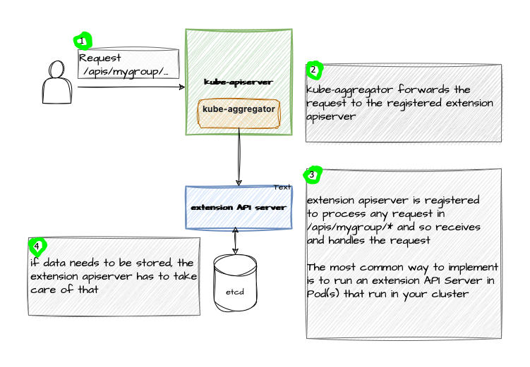

# Extending the Kubernetes API

<div v-click>

Kubernetes API is designed to **evolve** and **grow** with new use cases.

</div>

<div v-click>

Two primary methods to extend it:

</div>

<div v-click>

1. **CustomResourceDefinition (CRD)**  
   - Declaratively define new custom APIs.  
   - No need for a custom API server.

</div>

<div v-click>

2. **Aggregation Layer**  
   - Proxy-based extension with a custom API server.  
   - For specialized implementations.

</div>

::right::

<div v-click>

<p style="text-align: center;">
  
</p>

</div>

<!-- 
As Kubernetes adapts to new and changing use cases, its API must evolve. This slide introduces the two main ways to extend the Kubernetes API: CustomResourceDefinition (CRD) for declarative resource creation without a custom server, and the Aggregation Layer for more complex, custom server-based extensions. The diagram illustrates how these extensions integrate with the Kubernetes API.
-->

---
transition: slide-up
layout: two-cols
---

# CustomResourceDefinition (CRD)

<div v-click>

**CRDs** allow you to:

</div>

<div v-click>

- Define new resource types with custom:  
  - API group  
  - Kind  
  - Schema

</div>

<div v-click>

- Extend Kubernetes without a custom API server.

</div>

<div v-click>

- Create RESTful resource paths automatically.

</div>

::right::

<div v-click>

Example CRD:

```yaml
apiVersion: apiextensions.k8s.io/v1
kind: CustomResourceDefinition
metadata:
  name: myresources.example.com
spec:
  group: example.com
  names:
    kind: MyResource
    plural: myresources
  versions:
  - name: v1
    served: true
    storage: true
    schema:
      openAPIV3Schema:
        type: object
        properties:
          spec:
            type: object
            properties:
              replicas:
                type: integer
```
</div>
<!-- 
CustomResourceDefinitions (CRDs) are a powerful way to extend Kubernetes by defining new resource types declaratively. You specify the API group, kind, and schema, and Kubernetes generates RESTful endpoints for them. No custom server is needed! On the right, we see a sample CRD for a resource called "MyResource" in the "example.com" group, with a simple schema including a "replicas" field. In this section, we’ll dive deep into the creation and management of Custom Resource Definitions in Kubernetes.
-->

