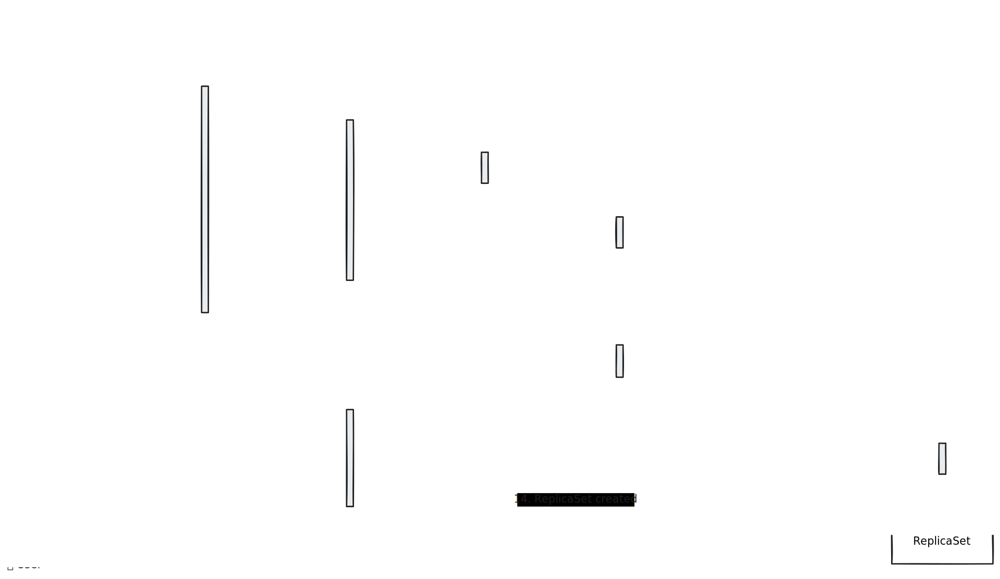
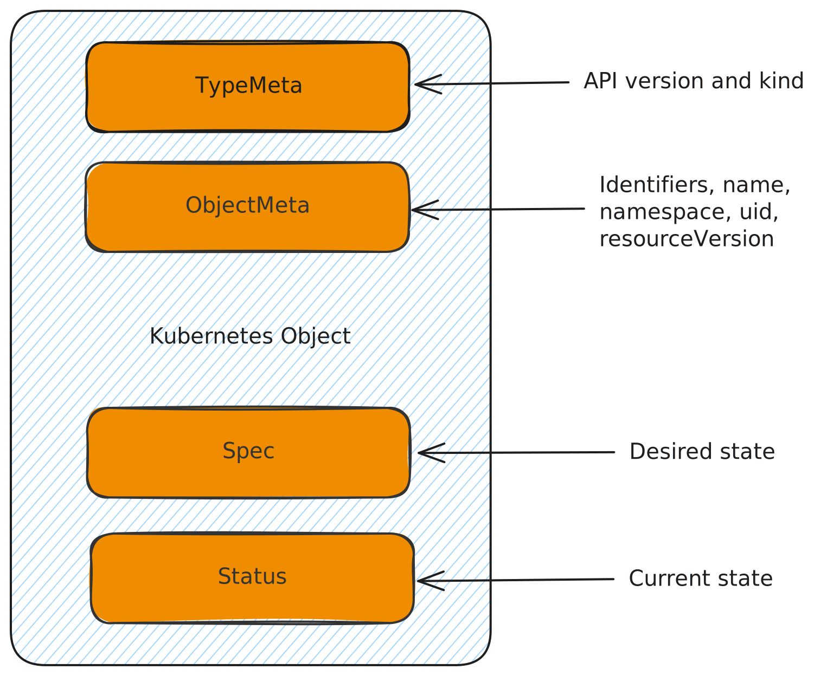

# Kubernetes API

Understand how Kubernetes API works and how to interact with it.

<div class="abs-br m-6 text-xl">
  <a href="https://github.com/aghilish" target="_blank" class="slidev-icon-btn">
    <carbon:logo-github />
  </a>
  <a href="https://www.linkedin.com/in/aghilish/" target="_blank" class="slidev-icon-btn">
    <carbon:logo-linkedin />
  </a>
</div>
<!-- 
Welcome to the Kubernetes API Overview presentation. In this session, we will dive deep into the Kubernetes API architecture, resources, and usage.
-->
---
transition: fade-out
hideInToc: true
---

# Agenda
<div v-click>
<Toc text-sm minDepth="1" maxDepth="1" />
</div>
<!-- 
Here is the agenda for today's presentation. We will cover the Kubernetes API architecture, how to interact with the API, API groups and versions, and the Kubernetes object model.
-->
---
transition: slide-up
layout: two-cols
---
# Kubernetes API Architecture

<div v-click>

The **Kubernetes API** is the core mechanism for interacting with a Kubernetes cluster.

</div>
<div v-click>
Kubernetes API provides:
</div>

<div v-click>

* Declarative configuration of resources
</div>
<div v-click>

* Communication between components
</div>
<div v-click>

* RESTful interface for automation
</div>
<div v-click>

* Authentication & Authorization mechanisms
</div>

::right::


<div v-click>

**Kubernetes API** is structured into:
</div>

<div v-click>

* **API Server (`kube-apiserver`)** - Main entry point for requests.
</div>

<div v-click>

* **Etcd** - Persistent storage for cluster state.
</div>

<div v-click>

* **Admission Controllers** - Validate & modify requests.
</div>

<div v-click>

* **Controllers & Operators** - Watches for resource changes and reconcile the drift between actual and desired state.
</div>
<!-- 
The Kubernetes API is structured into several components. The API Server, also known as kube-apiserver, is the main entry point for requests. It handles all incoming API requests and validates them. The etcd component is the persistent storage for the cluster state. Admission Controllers validate and modify requests, while Controllers and Operators watch for resource changes and reconcile the drift between the actual and desired state.
-->
---
layout: center
---
<div v-click>
<br/>
<br/>
  
</div>
<!--  Let's walk through the sequence of events when a user creates a deployment using `kubectl`. 1. The user creates a deployment with `kubectl`. 2. The `kubectl` request is forwarded to the API server. 3. The request is then sent to the admission plugins. 4. Once the request is validated by the admission plugins, the deployment object is saved to the `etcd` database. 5. The deployment created event is prompted to the user. 6. The deployment controller watches for new deployment objects. 7. It detects the new deployment created. 8. The deployment controller initiates a ReplicaSet creation. 9. The ReplicaSet creation is communicated to the API server. 10. Similar to the deployment controller, the ReplicaSet controller creates the necessary resources, such as pods, and so on. This sequence ensures that the desired state specified by the user is achieved and maintained by Kubernetes. -->
---
---

# Interacting with the API

You can interact with Kubernetes API using:
<div v-click>

  1. `kubectl` - Command-line interface

</div>
<div v-click>

  2. API Requests - Direct REST API calls

</div>
<div v-click>

  3. Client Libraries - SDKs for various languages

</div>

<div v-click>

  4. Web UIs - Dashboard, Lens, Octant

</div>

<div v-click>

  5. Custom Controllers - Extend API with CRDs

</div>


<div v-click>

Example API call:

```bash
curl -X GET "https://k8s-api-server/api/v1/nodes" -H "Authorization: Bearer TOKEN"
```
</div>

<!-- 

You can interact with the Kubernetes API using several methods:

First, we have kubectl, the command-line interface. It is the most common tool for managing Kubernetes clusters and performing various operations.

Next, you can make direct REST API calls. This allows you to interact with the API programmatically using HTTP requests.

Another option is to use client libraries. These SDKs are available for various programming languages and provide a more convenient way to interact with the API.

You can also use web UIs such as the Kubernetes Dashboard, Lens, and Octant. These graphical interfaces make it easier to visualize and manage your cluster.

Finally, you can extend the API with custom controllers and Custom Resource Definitions (CRDs). This allows you to add new resource types and automate complex workflows.

Here is an example of an API call using curl:

This command retrieves information about the nodes in your cluster.
-->
---
---
# API Groups and Versions

  <div v-click>
    Kubernetes API is organized into groups and versions:
  </div>
  
  <div v-click>

  1. **Core group**
        Includes _Nodes_, _Pods_, _Namespaces_, _Services_, _ConfigMaps_, and _Secrets_.
  </div>

  <v-click>

  <span v-mark.red="3"></span>
    <span v-mark.circle.orange="4"><code>api/v1/</code></span>
<code>namespaces/{namespace}/secrets</code>
  </v-click>

<div v-click></div>

  <div v-click>

  2. **Named groups**
        Categorize related functionalities.
  </div>
  <div v-click>

 `apps`: Manages _deployments_, _stateful sets_, _daemon sets_, and _replica sets_.
  </div>

  <v-click>

  <span v-mark.red="3"></span>
    <span v-mark.circle.orange="5"><code>apis/apps/v1/</code></span>
<code>namespaces/{namespace}/deployments</code>
  </v-click>

  <div v-click>

  3. **Cluster Scoped Resources**
        that are not bound to a namespace.
  <br>
  </div>
     <v-click>
      <code>apis/rbac.authorization.k8s.io/v1/clusterroles</code>
  </v-click>
  
<arrow v-click="[10,11]" x1="700" y1="390" x2="550" y2="390" color="orange" width="2" arrowSize="1" />
<div v-click>
   <code>no namespace in the path!</code>
  </div>

<!-- 
The Kubernetes API is organized into groups and versions to manage the various resources within a cluster.

First, we have the Core group. This includes essential resources such as Nodes, Pods, Namespaces, Services, ConfigMaps, and Secrets. These resources are accessed via the api/v1/ endpoint. For example, to access secrets within a namespace, you would use the path api/v1/namespaces/{namespace}/secrets.

Next, we have Named groups. These groups categorize related functionalities. For instance, the apps group manages resources like deployments, stateful sets, daemon sets, and replica sets. The path for accessing deployments within a namespace would be apis/apps/v1/namespaces/{namespace}/deployments.

Additionally, there are Cluster Scoped Resources that are not bound to a namespace. An example of this is the clusterroles resource, which is accessed via the path apis/rbac.authorization.k8s.io/v1/clusterroles. Note that there is no namespace in the path for these resources.
-->
---
hideInToc: true
---

# API Groups and Versions

```yaml {all|1|2|all} twoslash
apiVersion: apps/v1 # Group and version of the resource
kind: Deployment # The concrete representation (schema) of a resource type 
metadata:
  name: my-deployment
```
<div v-click>

  **Resource Type** is the name used in the REST path 

</div>
<v-click>
  <span><code>apis/apps/v1/namespace/{namespace}/</code></span>
    <span v-mark.circle.orange="5"><code>deployments</code></span>
</v-click>

<div v-click>

  To see all the available API resources in your cluster:

</div>

<div v-click>
```bash
$ kubectl api-resources
NAME                                SHORTNAMES   APIVERSION                                NAMESPACED   KIND
bindings                                         v1                                        true         Binding
configmaps                          cm           v1                                        true         ConfigMap
endpoints                           ep           v1                                        true         Endpoints
events                              ev           v1                                        true         Event
limitranges                         limits       v1                                        true         LimitRange
namespaces                          ns           v1                                        false        Namespace
nodes                               no           v1                                        false        Node
persistentvolumeclaims              pvc          v1                                        true         PersistentVolumeClaim
persistentvolumes                   pv           v1                                        false        PersistentVolume
pods                                po           v1                                        true         Pod
```
</div>

<!-- 
Here is an example of a resource definition in YAML format. The apiVersion field specifies the group and version of the resource, while the kind field defines the concrete representation or schema of the resource type. In this case, it is a Deployment.

The Resource Type is the name used in the REST path. For example, the path to access deployments within a namespace would be apis/apps/v1/namespaces/{namespace}/deployments.

To see all the available API resources in your cluster, you can use the kubectl api-resources command. This command lists all the resources, their short names, API versions, whether they are namespaced, and their kind.
-->


---
layout: two-cols
hideInToc: true
---
# Kubernetes Object Model
<div v-click>
  Every Kubernetes object must have:
</div>
<div v-click>

  - **TypeMeta**: API version and kind.
</div>
<div v-click>

  - **ObjectMeta**: Identifiers, name, namespace, uid, resourceVersion.
</div>
<div v-click>

  - **Spec**: Desired state.
</div>
<div v-click>

  - **Status**: Current state.
</div>
::right::
<div v-click>

  
</div>
<!-- 
Every Kubernetes object must have several key fields. The TypeMeta field defines the object's API version and kind. The ObjectMeta field contains identifiers such as name, namespace, uid, and resourceVersion. It also includes timestamps for creation and deletion, as well as labels and annotations for organization and categorization. The spec field represents the desired state of the object, while the status field summarizes the current state of the object in the system.
-->
---
---
# Kubernetes Object Model
```yaml {all|1|2|3|4|5|6|7|8|9|10|12|14|21|all} twoslash
apiVersion: v1  # TypeMeta defines the object's API version
kind: Pod  # TypeMeta defines the object's kind
metadata:  # Identifiers, name, namespace, uid, resourceVersion
  namespace: default  # The default namespace is 'default'. Cluster wide resources do not have this field set.
  name: my-pod  # A string that uniquely identifies this object within the current namespace. This value is used in the path when retrieving an individual object.
  uid: 123e4567-e89b-12d3-a456-426614174000  # A unique in time and space value used to distinguish between objects with the same name that have been deleted and recreated.
  resourceVersion: "12345"  # A string that identifies the internal version of this object that can be used by clients to determine when objects have changed.
  creationTimestamp: "2025-02-09T12:00:00Z"  # A string representing the date and time an object was created.
  deletionTimestamp: "2025-02-10T12:00:00Z"  # A string representing the date and time after which this resource will be deleted.
  labels:  # A map of string keys and values that can be used to organize and categorize objects.
    app: my-app
  annotations:  # A map of string keys and values that can be used by external tooling to store and retrieve arbitrary metadata about this object.
    description: "This is a sample pod"
spec:  # A nested object field called spec represents the desired state of an object.
  containers:
  - name: my-container
    image: nginx:latest
    ports:
    - containerPort: 80
  restartPolicy: Always
status:  # A nested object field called status summarizes the current state of the object in the system.
  phase: Running
  conditions:
  - type: Ready
    status: "True"
  hostIP: 192.168.1.1
  podIP: 192.168.1.2
  startTime: "2025-02-09T12:01:00Z"
```
<!-- 
Here is an example of a Kubernetes object in YAML format. The apiVersion field specifies the API version, and the kind field defines the type of the resource, in this case, a Pod. The metadata field contains identifiers such as namespace, name, uid, resourceVersion, creationTimestamp, deletionTimestamp, labels, and annotations. The spec field represents the desired state of the object, including the containers, their images, ports, and restart policy. The status field summarizes the current state of the object, including the phase, conditions, host IP, pod IP, and start time.
-->
---
layout: center
---

# Wanna Learn More?
<Youtube id="azJsyLjvHsI" />
[Killercoda Lab](https://killercoda.com/aghilish/scenario/extending_k8s) . [API Reference](https://kubernetes.io/docs/reference/kubernetes-api/) . [kubectl](https://kubernetes.io/docs/reference/kubectl/)

<!-- 
Thank you for attending this presentation on Kubernetes API. If you want to learn more, you can watch the video linked here or visit the Kubernetes documentation for more information on the API reference, kubectl, and RBAC.
-->